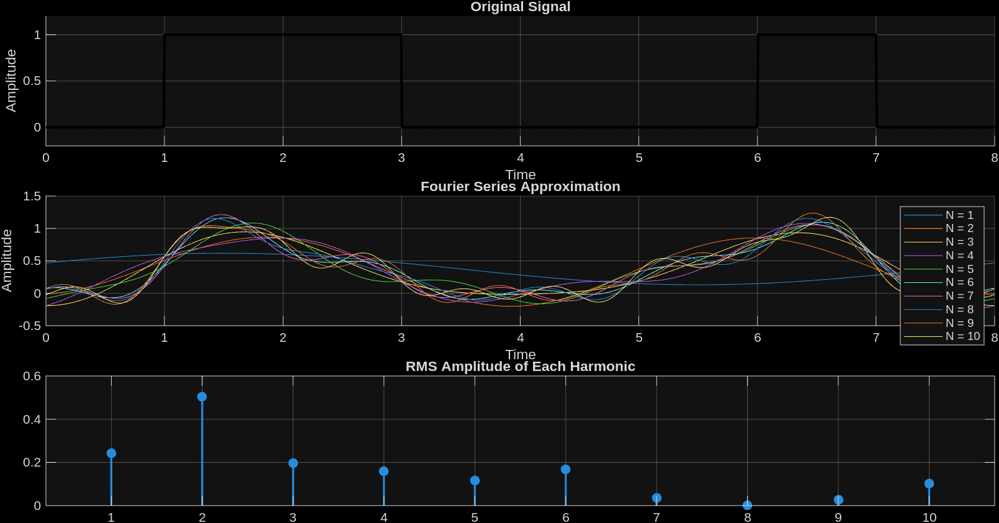
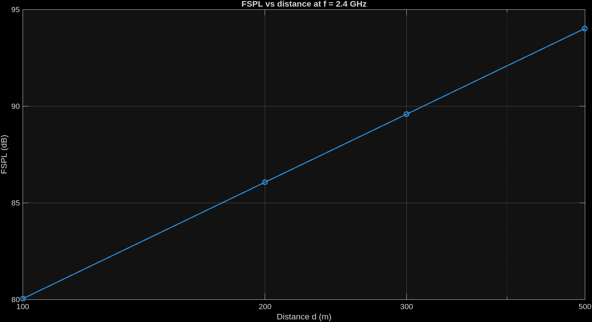
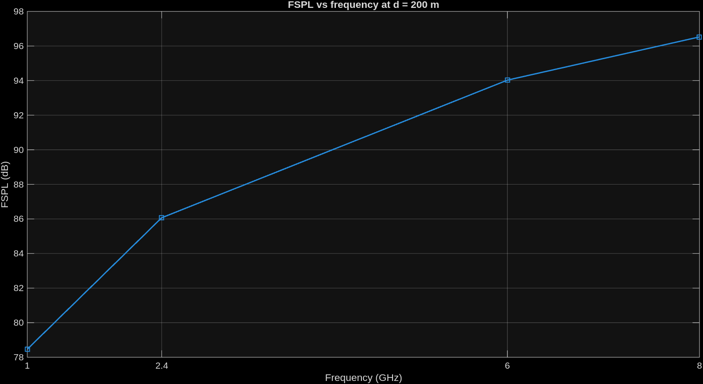
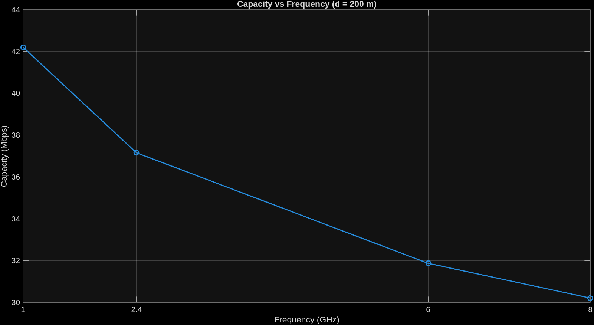
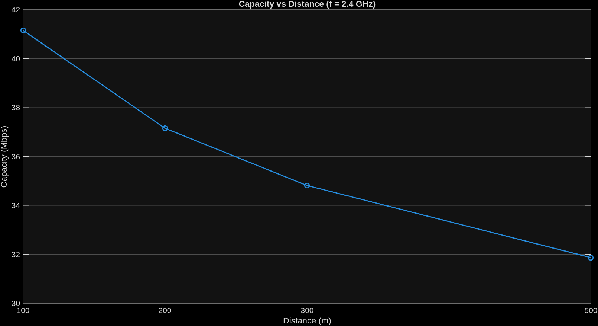
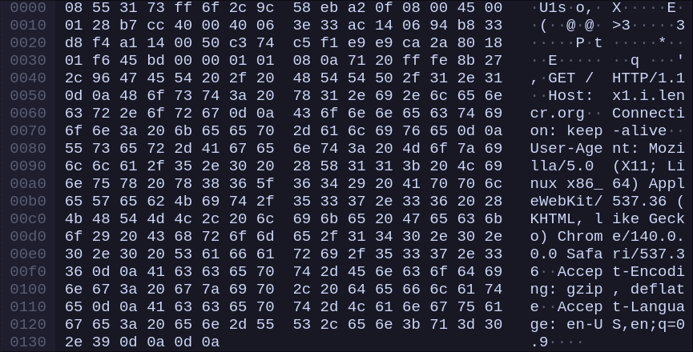
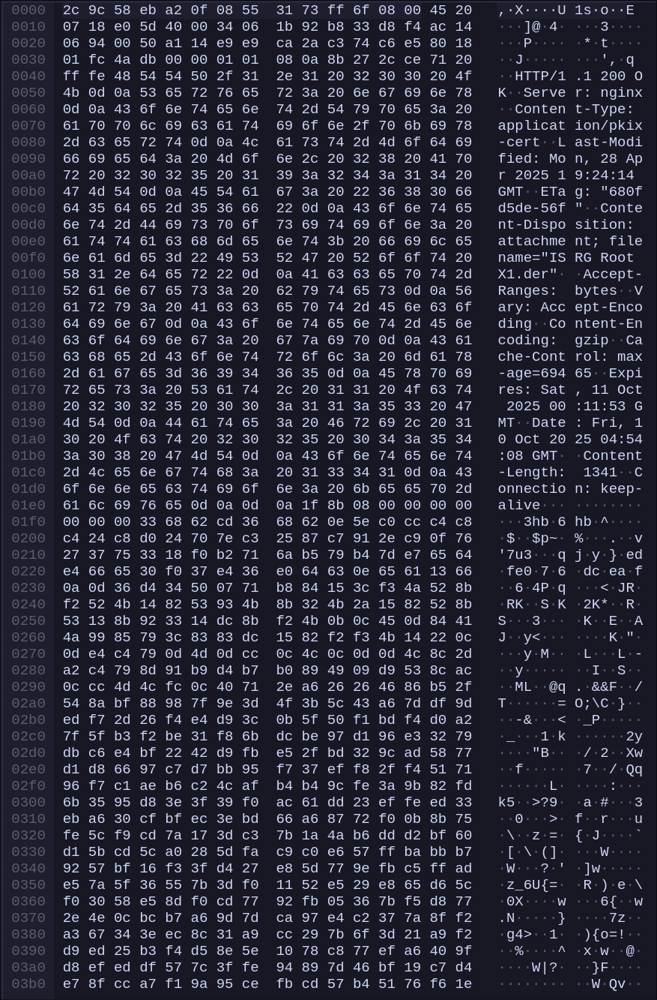
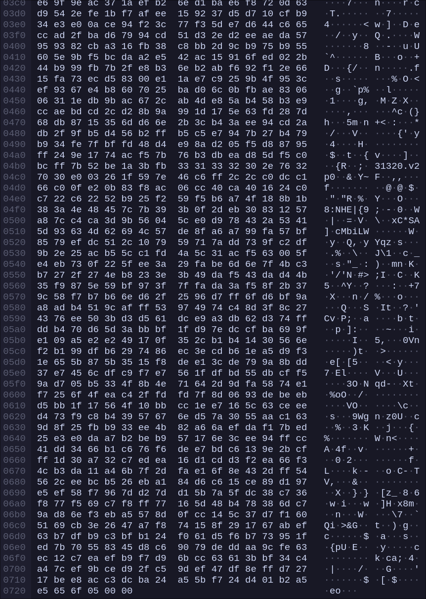
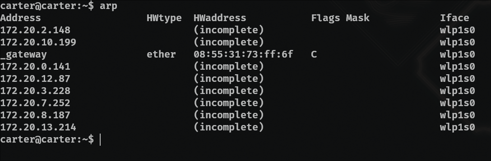
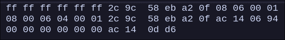

# Project 1

## q1

code can be found in Appendix 1

3a.
i i belive it may be possible to reconstruct the original signal from 10 samples, but i think for clarity more samples would be better.

## q2

code can be found in  Appendix 2

2a.

2b.

## q3

3a. 2c 9c 58 eb a2 0f

3b. 08 55 31 73 ff 6f
it is the address of my router

3c. 80 00
IPv4

3d. byte 0042 which is 66 in decimal making it the 67th byte

3e. 08 55 31 73 ff 6f
this is the same address as the destination of the last packet, it is my router

3f. 2c 9c 58 eb a2 0f
yes it is

3g 08 00
IPV4

3h. it is also byte 0042, therefor it is also the 67th byte

## q4

4a. the address is the ip adress, HWtype is the type of connection, HW address is the mac address, Flags indicate if the mac adress is complete or not, and whether it was manually set or not, iface is the interface that each address is connecting through

4b. 
Source: 2c 9c 58 eb a2 0f
Destination: ff ff ff ff ff ff

4c. 0806
ARP

4d.
    i. 14 bytes
    ii. 00 01 request
    iii. yes
    iv. at the very end of the packet

4e. 
    i. 14 again
    ii. 00 02 reply
    iii. right before the target ip address

4f. (i didnt get a response from the device i pinged, but i did get a response from a different device so i will use that instead)

source: (2c:9c:58:eb:a2:0f)
Destination: (08:55:31:73:ff:6f)

## APPENDIX

### 1

~~~
clear;
clc;
close all;

T=8;
f = 1/T;
t = linspace(0, T, 1000);

bits = [0 1 1 0 0 0 1 0];
signal = zeros(size(t));

for k = 1:8
    signal(t >= (k-1) & t<k) = bits(k);
end

figure;
subplot(3,1,1);
hold on;
plot(t, signal, 'k', 'LineWidth', 2);
ylim([-0.2 1.2]);
title('Original Signal');
xlabel('Time');
ylabel('Amplitude');
grid on;

c = 3/4;
N_Values = 1:10;
colors = lines(length(N_Values));

subplot(3,1,2);
hold on;

for N = N_Values
    g = 0.5*c;
    for n = 1:N
        an = (1/(pi*n))*(cos((pi*n)/4)-cos((3*pi*n)/4)+cos((6*pi*n)/4)-cos((7*pi*n)/4));
        bn = (1/(pi*n))*(sin((3*pi*n)/4)-sin((pi*n)/4)+sin((7*pi*n)/4)-sin((6*pi*n)/4));
        
        g = g + an * sin(2*pi*N*f*t) + bn * cos(2*pi*n*f*t);

    end

    plot(t, g, 'Color', colors(N,:), 'DisplayName', sprintf('N = %d', N));
end

title('Fourier Series Approximation');
xlabel('Time');
ylabel('Amplitude');
legend show;
grid on;

a_vals = zeros(1,10);
b_vals = zeros(1,10);
rms_vals = zeros(1,10);

for n = 1:10
    a_vals(n) = (1/(pi*n))*(cos((pi*n)/4)-cos((3*pi*n)/4)+cos((6*pi*n)/4)-cos((7*pi*n)/4));
    b_vals(n) = (1/(pi*n))*(sin((3*pi*n)/4)-sin((pi*n)/4)+sin((7*pi*n)/4)-sin((6*pi*n)/4));
    rms_vals(n) = sqrt(a_vals(n)^2 + b_vals(n)^2);
end

subplot(3,1,3);
stem(1:10, rms_vals, 'filled', 'LineWidth', 1.5);
title('RMS Amplitude of Each Harmonic');
grid on;
~~~

### 2

~~~
clear; close all; clc;

c = 3e8;                
Pt_dbm = 30;            
Gt = 3;                 
Gr = 1;                 
L_tx = 1;               
L_rx = 2;              
N0_dbmHz = -174;        
B = 2e6;       

% 2a
f_24 = 2.4e9;
d_list = [100, 200, 300, 500];

fspl = @(d,f) 20*log10(4*pi.*d.*f./c);

FSPL_d = fspl(d_list, f_24);

figure;
semilogx(d_list, FSPL_d, '-o','LineWidth',1.4);
grid on;
xlabel('Distance d (m)'); ylabel('FSPL (dB)');
title('FSPL vs distance at f = 2.4 GHz');
xticks(d_list);

d_fixed = 200;
f_list = [1e9, 2.4e9, 6e9, 8e9];
FSPL_f = fspl(d_fixed, f_list);

figure;
plot(f_list/1e9, FSPL_f, '-s','LineWidth',1.4);
grid on;
xlabel('Frequency (GHz)'); ylabel('FSPL (dB)');
title('FSPL vs frequency at d = 200 m');
xticks(f_list/1e9);

% 2b
recv_power_dbm = @(d,f) Pt_dbm + Gt - L_tx - fspl(d,f) + Gr - L_rx;

N_dbm = N0_dbmHz + 10*log10(B);

% i)
Pr_i = arrayfun(@(f) recv_power_dbm(d_fixed,f), f_list);
SNR_db_i = Pr_i - N_dbm;
SNR_lin_i = 10.^(SNR_db_i/10);
Capacity_i = B .* log2(1 + SNR_lin_i);

% ii)
Pr_ii = arrayfun(@(d) recv_power_dbm(d,f_24), d_list);
SNR_db_ii = Pr_ii - N_dbm;
SNR_lin_ii = 10.^(SNR_db_ii/10);
Capacity_ii = B .* log2(1 + SNR_lin_ii);

fprintf('\nCase (i)\n');
for i=1:length(f_list)
    fprintf(' f=%.1f GHz: Pr = %.3f dBm, SNR = %.3f dB, Capacity = %.3f Mbps\n', ...
        f_list(i)/1e9, Pr_i(i), SNR_db_i(i), Capacity_i(i)/1e6);
end

fprintf('\nCase (ii)\n');
for i=1:length(d_list)
    fprintf(' d=%d m: Pr = %.3f dBm, SNR = %.3f dB, Capacity = %.3f Mbps\n', ...
        d_list(i), Pr_ii(i), SNR_db_ii(i), Capacity_ii(i)/1e6);
end

figure;
plot(f_list/1e9, Capacity_i/1e6, '-o','LineWidth',1.4);
grid on;
xlabel('Frequency (GHz)'); ylabel('Capacity (Mbps)');
title('Capacity vs Frequency (d = 200 m)');
xticks(f_list/1e9);

figure;
plot(d_list, Capacity_ii/1e6, '-o','LineWidth',1.4);
grid on;
xlabel('Distance (m)'); ylabel('Capacity (Mbps)');
title('Capacity vs Distance (f = 2.4 GHz)');
xticks(d_list);
~~~