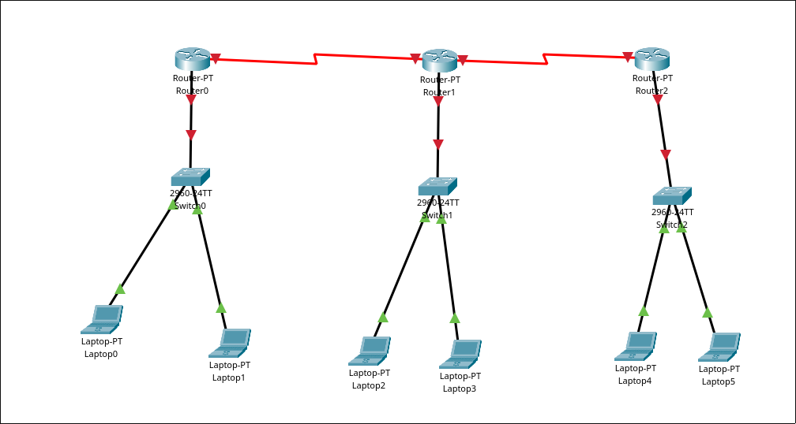
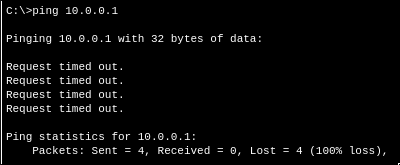

# project 3

# Network Layer Concepts

## 1

## 2

### (a)

it pinged the other laptop on the same switch and recieved a quick near instant response

### (b)

the ping cannot reach the other router

### (c)

the pdu can reach the other laptop on the same network

### (d)

the pdu cannot reach the other laptop on a different network

## 3

### (a)

the routers need routing table entries for the other subnets

## 4

### (a)
both PDUs were successful and routed directly to and from laptop 0

### (b)

the laptop routes through the two routers and to the other laptop successfully

# Transport layer concepts

## 1

4: source port, destination port, length, checksum

## 2

they are each wto bytes long

## 3

the length of the whole UDP datagram. including header

## 4

65507

## 5

65535

## 6

hex: 11
dec: 17

## 7

the source and destinations of the two packets flip

# Open Ended Questions

UDP: short header, simple, no sequencing/ACK

TCP: longer header, more complex, includes ordering/ACK

QUIC: long header, has TCP like qualities, implimented over UDP