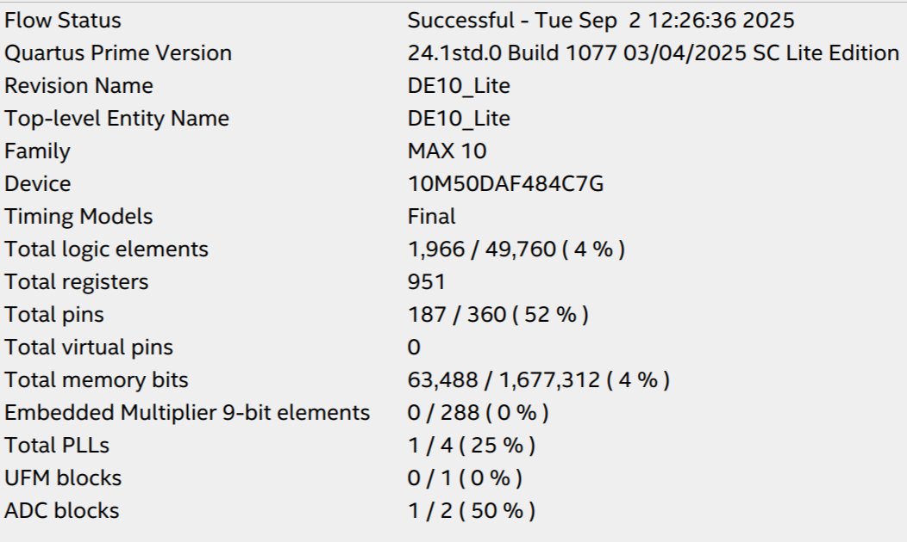
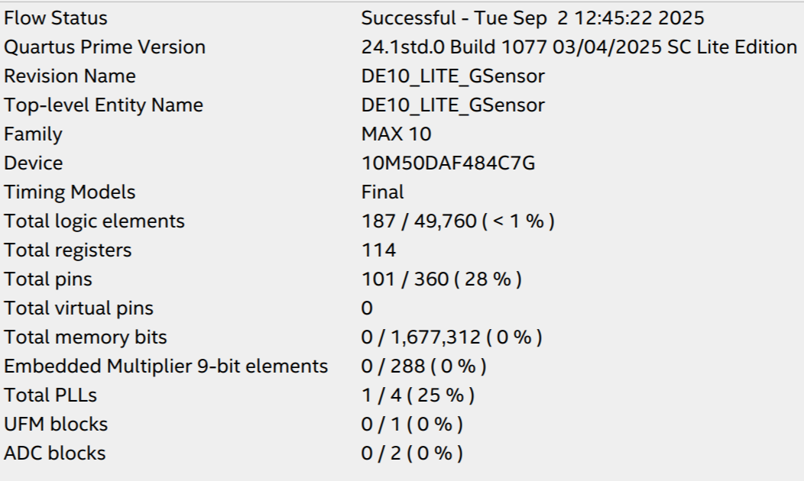
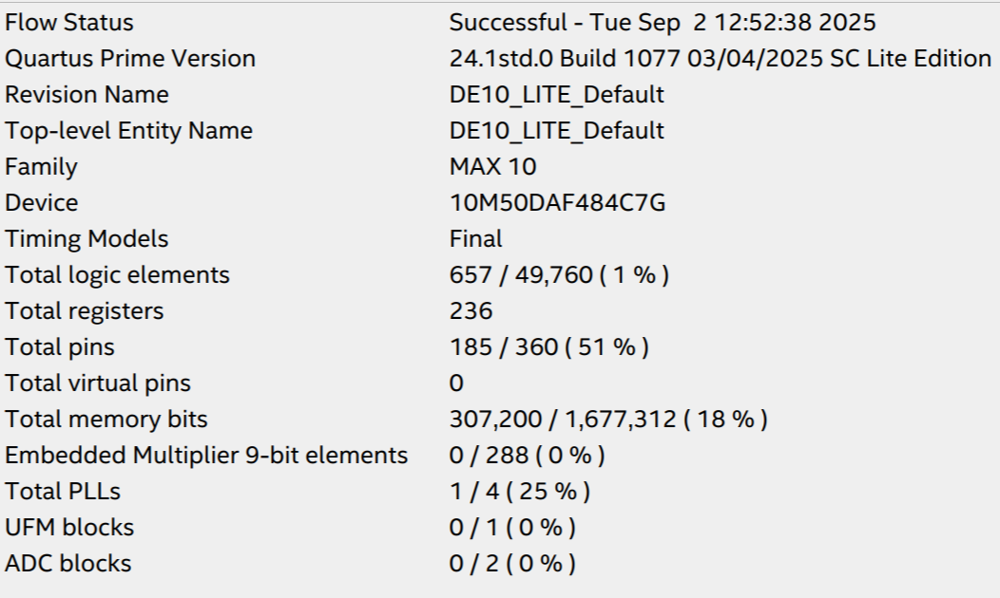

# Development Tools Intro

## ADC_RTL

This Project displays the voltage of the selected ADC on the 7-segment Display. the ADC is selected via the last 3 switches. it occasionaly blinks the LEDs, it is unclear what that indicates.

Inputs: Switches 

Outputs: LEDs, Seven-Segment Display 

## GSensor

This Project displays the output of the Accelerometer on the LED. it does this by lighting the "Top" LED based on Gravity. 

Inputs: Accelerometer 

Outputs: LED 

## Default

This project displays an increasing counter on the seven-segment display, it also displays various patterns on the leds, as well as the terrasic logo on the VGA display. if the first switch is set, the LEDs behave the same as they do in GSensor, and if the first button is pressed all the LEDs are set to on.

Inputs: Accelerometer, Buttons, Switches

Outputs: LEDs, Seven-Segment Display, VGA
